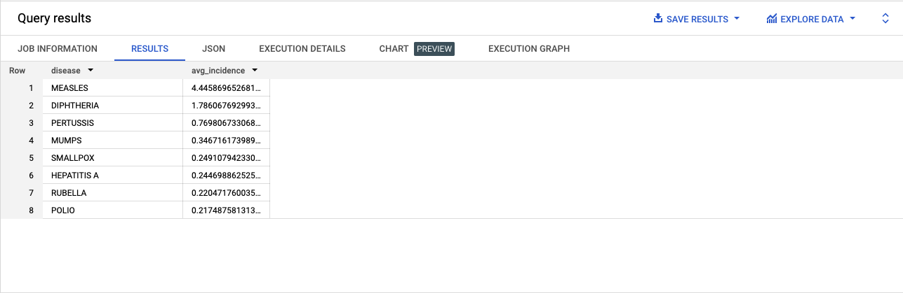

# SQL Basics Cheat Sheet

A quickstart guide to SQL Queries for beginners. 

## Contents 

- [Introduction](#introduction)
- [Reserved Words](#reserved-words)
  - [SELECT](#select)
  - [FROM](#from)
  - [WHERE](#where)
  - [GROUP BY](#group-by)
  - [ORDER BY](#order-by)
- [Conclusion](#conclusion)
- [References & Resources](#references--resources)

## Introduction 

In this cheat sheet, you’ll find a list of the basic SQL queries, what they mean, and example code snippets. For these examples, I used [Google’s BigQuery](https://console.cloud.google.com/bigquery) to practice. Depending on the SQL database you use the naming conventions of the columns and tables may be different, but the basic set up of the queries will be the same.

## Reserved Words

### SELECT

**What it does**:

- Specifies or “selects” the column(s) you want to query
- Can use the asterisk `*` if you want to select all the columns in the database
- `databaseName.columnName` → for specifying which DB and column, useful when joining datasets

### FROM

**What it does**:

- Specifies which table to pull data from
- At this stage you can introduce an alias for column names by adding it to the end of the `FROM` clause. This is useful for making them easier to remember. For example, `FROM Player_Attributes attributes`

**Example**:

```sql
SELECT
  *
FROM
  `bigquery-public-data.usa_contagious_disease.project_tycho_reports`
```

Here we will get all of the columns from the table Project Tycho Reports of the USA Contagious Disease dataset. 

 

As you can see there are 759,467 rows in the results. That’s a lot and this is where adding other clauses will help narrow down the results. Alternatively, we also have the option to export the data which then can be used with other analysis software or programming language (e.g., Python) to better understand it.

Instead of using the asterisk `*` to select all the columns we could also select a single column name (or multiple column names separated by commas `,`):

```sql
SELECT
  disease
FROM
  `bigquery-public-data.usa_contagious_disease.project_tycho_reports`
```

 

### WHERE

**What it does**:

- Specifies the condition(s) for the data you want to see (e.g., all values greater than 100)
- The percent symbol `%` can be used for searching strings
- The greater than `>` and less than `<` symbols are used for looking for numerical values
- The underscore `_` is used for searching for characters
- The `in` keyword performs an *exact* match while the `like` keyword performs a looser match
- There is also `between`, `and`, `or`, `is null`, `is not null`

**Example**:

```sql
SELECT
  *
FROM
  `bigquery-public-data.usa_contagious_disease.project_tycho_reports`
WHERE
  disease="MUMPS"
```

Here we can select all of the columns from the table, but the `WHERE` clauses specifies we only want the entries where the disease is MUMPS. This means other diseases are not included. 

 

Here’s another example where we are looking for a numerical value. In this case, when the number of incidences of a disease per 100,000 people is greater than 1. 

```sql
SELECT
  *
FROM
  `bigquery-public-data.usa_contagious_disease.project_tycho_reports`
WHERE
  incidence_per_100000>1
```

 

We can even combine these statements together with the `and` keyword and look for the disease “MUMPS” where the incidence per 100,000 people is greater than 1. 

```sql
SELECT
  *
FROM
  `bigquery-public-data.usa_contagious_disease.project_tycho_reports`
WHERE
  disease="MUMPS" and incidence_per_100000>1
```

 

### GROUP BY

**What it does**:

- We can use the fields or column names to group things together

**Example**:

```sql
SELECT
  disease,
  AVG(incidence_per_100000) as avg_incidence
FROM
  `bigquery-public-data.usa_contagious_disease.project_tycho_reports`
GROUP BY
  disease
```

Here we have a list of the average incidence per 100,000 people grouped by disease. 

There are two things to note in this example: 

1. I used the keyword `as` to give an alias to the `avg_incidence`. This can be used when doing a calculation or with column name that might be particularly long. This helps us make the column names more human-friendly. 
2. There is no ordering to this list, but we can fix that with our next example when we use the `ORDER BY` clause.

 

### ORDER BY

**What it does**:

- Here we can specify a column name to order the results by
- By default, it’s in ascending order buy we can add `DESC` to the end for descending order

**Example**:

```sql
SELECT
  disease,
  AVG(incidence_per_100000) as avg_incidence
FROM
  `bigquery-public-data.usa_contagious_disease.project_tycho_reports`
GROUP BY
  disease
ORDER BY 
  avg_incidence
```

Here we have a list of the average incidence per 100,000 people grouped by disease and ordered based on the incidence. 

By default, it is listed from lowest to highest (ascending order). But we can also add the keyword `desc` to the `ORDER BY` clause in order to list it from highest to lowest (descending). See second example below. 

 

```sql
SELECT
  disease,
  AVG(incidence_per_100000) as avg_incidence
FROM
  `bigquery-public-data.usa_contagious_disease.project_tycho_reports`
GROUP BY
  disease
ORDER BY 
  avg_incidence desc
```



## Conclusion

Those are the basic SQL queries you need to get started with querying a database. At the very least, you need to know how to use `SELECT` and `WHERE` so that you can pull data out. However, it’s helpful to know other clauses like `GROUP BY` and `ORDER BY` to narrow down or filter your data. This is particularly helpful with large datasets. 

We also got a preview of how we can use functions, like `AVG()`, to perform calculations and return the results in a column. This helps us get a quick glance at the shape of the data which might leads us to areas for deeper exploration. 

This is just a quick start guide. Like all things technology, there’s a lot more you can do with SQL and I’m not an expert by any means. But I do enjoy learning and sharing what I learn as I go. If you’d like to learn more about SQL, checkout the ‘References & Resources’ section. I’ve included a list of resources that were helpful to me when learning SQL and writing this post. Happy coding! 

## References & Resources

If you want to take a deeper dive into SQL queries, I found the following resource helpful while writing this post. 

- [Learn Basic SQL](https://youtu.be/kbKty5ZVKMY) in 15 Minutes (YouTube Tutorial by Adam Finer)
- [SQL Basics Cheat Sheet](https://www.datacamp.com/cheat-sheet/sql-basics-cheat-sheet) by Datacamp
- [SQL Cheat Sheet](https://www.dataquest.io/blog/sql-cheat-sheet/) by Dataquest
- [SQL Style Guide](https://www.sqlstyle.guide/) by Simon Holywell
